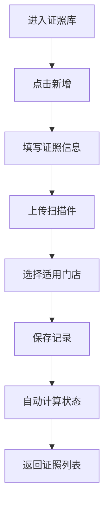
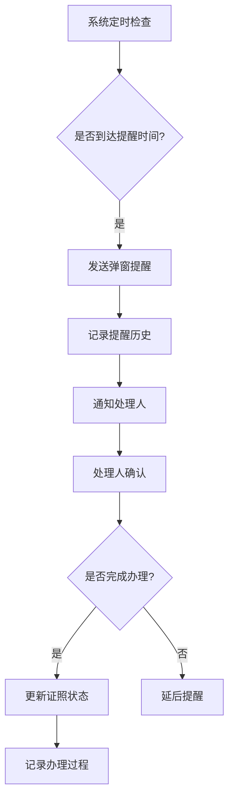

# 证照到期管家 - 产品需求文档

## 1. 产品概述

证照到期管家是一款面向门店和机构的证照管理系统，用于集中管理营业执照、人员资格证和设备检验证等重要证照。通过智能提醒和分类统计功能，帮助机构确保证照始终保持有效状态，避免因证照过期带来的法律风险和经营中断。

- 集中管理营业执照、人员资格证、设备检验证等多种证照类型
- 支持多门店/多机构统一管理，具备智能预警和到期提醒功能
- 提供完整的证照生命周期管理，从录入到办理记录全流程追踪

## 2. 核心功能

### 2.1 用户角色

| 角色 | 描述 | 核心权限 |
|------|------|---------|
| 管理员 | 系统管理员 | 全部功能、用户管理、系统设置 |
| 操作员 | 普通操作人员 | 证照管理、提醒设置、记录查看 |

### 2.2 功能模块

1. **总览页面**：证照状态仪表盘，快速掌握所有证照状态
2. **证照库页面**：证照信息录入、编辑、查询、附件管理
3. **提醒页面**：提前天数设置、处理人分配、弹窗提醒配置
4. **办理记录页面**：证照办理全流程记录追踪
5. **统计页面**：多维度数据分析、可视化图表、导出报表

## 3. 页面详细说明

### 3.1 总览页面（仪表盘）

**功能描述**：以卡片和图表形式展示所有证照的整体状态分布，提供快速入口查看即将到期和已过期证照。

**核心模块**：
| 模块名称 | 功能说明 |
|---------|---------|
| 状态统计卡片 | 正常状态、即将到期（30天内）、已过期数量统计 |
| 分类饼图 | 按证照类型（营业执照/资格证/检验证）分布展示 |
| 到期日历 | 月度视图展示即将到期的证照 |
| 最近动态 | 显示最新的证照状态变更记录 |
| 快速操作 | 一键跳转到证照库、提醒设置 |

**数据来源**：证照库页面录入的证照数据

---

### 3.2 证照库页面

**功能描述**：证照信息的主数据库，支持完整的CRUD操作和附件管理。

**核心字段**：
| 字段名称 | 字段类型 | 说明 |
|---------|---------|------|
| 证照编号 | 文本 | 证照唯一标识 |
| 证照类型 | 下拉选择 | 营业执照/人员资格证/设备检验证 |
| 持有人 | 文本 | 证照持有人姓名 |
| 发证单位 | 文本 | 颁发机构名称 |
| 有效期起 | 日期 | 证照生效日期 |
| 有效期止 | 日期 | 证照到期日期 |
| 适用门店 | 多选 | 证照适用的门店/机构 |
| 扫描件 | 文件上传 | 证照电子版扫描件 |
| 状态 | 下拉选择 | 正常/即将到期/已过期 |
| 备注 | 文本 | 补充说明 |

**操作功能**：
- 新增证照记录
- 编辑证照信息
- 删除证照记录
- 附件上传/预览/下载
- 批量导入/导出
- 搜索筛选（编号、持有人、状态等）

---

### 3.3 提醒页面

**功能描述**：配置证照到期提醒规则，确保证照及时续期。

**核心模块**：
| 模块名称 | 功能说明 |
|---------|---------|
| 提醒规则设置 | 设置提前提醒天数（7/15/30/60/90天） |
| 处理人分配 | 指定证照负责人/跟进人 |
| 提醒方式 | 弹窗提示/系统通知 |
| 提醒历史 | 查看已发送的提醒记录 |
| 批量设置 | 批量修改提醒规则 |

**提醒级别**：
- 紧急（7天内到期）：红色标识
- 重要（15天内到期）：橙色标识
- 一般（30天内到期）：黄色标识
- 提前（60/90天）：蓝色标识

---

### 3.4 办理记录页面

**功能描述**：记录证照办理全过程，便于追踪和审计。

**核心字段**：
| 字段名称 | 说明 |
|---------|------|
| 关联证照 | 关联到证照库中的具体证照 |
| 办理类型 | 新办/续期/变更/注销 |
| 提交材料 | 办理时提交的材料清单 |
| 受理时间 | 受理日期和时间 |
| 办理费用 | 实际发生的费用 |
| 办理结果 | 办理状态（受理中/已通过/未通过） |
| 完成时间 | 实际完成日期 |
| 办理备注 | 补充说明 |

---

### 3.5 统计页面

**功能描述**：多维度数据分析和可视化报表，支持决策支持。

**核心模块**：
| 模块名称 | 功能说明 |
|---------|---------|
| 门店统计 | 按门店汇总证照数量和状态分布 |
| 类型统计 | 按证照类型分类统计 |
| 月度趋势 | 按月份统计新增/到期/续期数量 |
| 费用统计 | 按时间段统计办理费用 |
| 搜索功能 | 高级搜索支持多条件组合 |
| 批量操作 | 批量更新证照状态 |
| 附件预览 | 在线预览扫描件 |
| 打印台账 | 生成打印友好的台账报表 |
| 导出清单 | 支持Excel/PDF格式导出 |

## 4. 核心流程

### 4.1 证照录入流程

### 4.2 提醒处理流程

## 5. 数据关联

### 5.1 实体关系

- 门店信息：与证照库一对多关系
- 证照库：与办理记录一对多关系
- 提醒规则：与证照库多对一关系
- 用户信息：与处理人字段关联

## 6. 非功能性需求

### 6.1 性能需求
- 页面加载时间 < 3秒
- 数据查询响应时间 < 1秒
- 支持至少1000条证照记录

### 6.2 安全需求
- 重要操作需二次确认
- 附件存储支持加密
- 操作日志完整记录

### 6.3 兼容性需求
- 桌面端应用，支持Windows系统
- 支持1024x768及以上分辨率
- 支持主流浏览器打印功能
