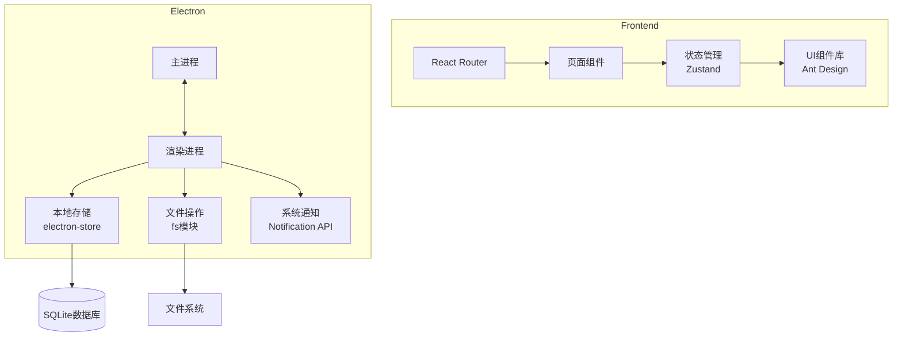
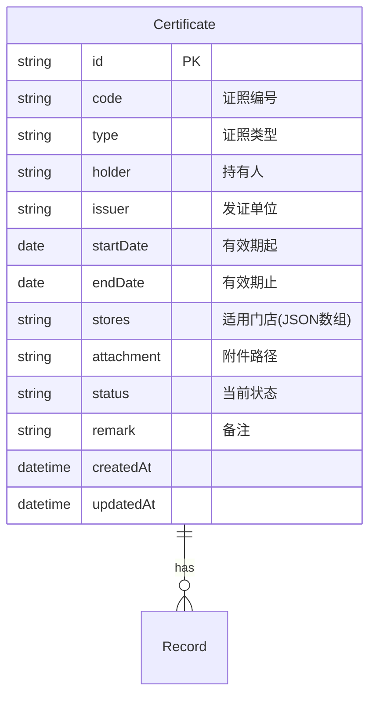
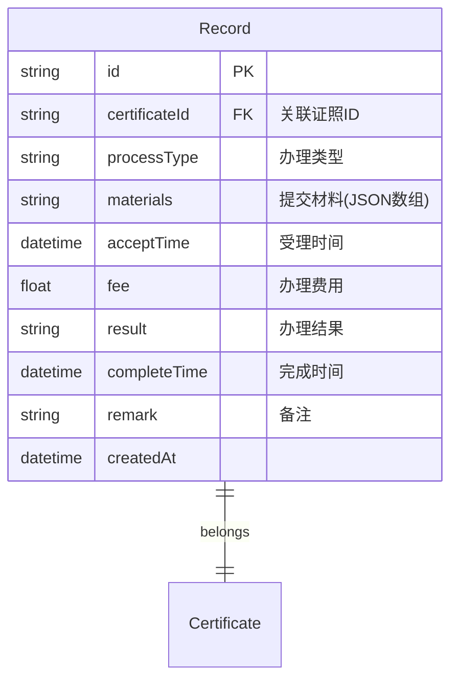
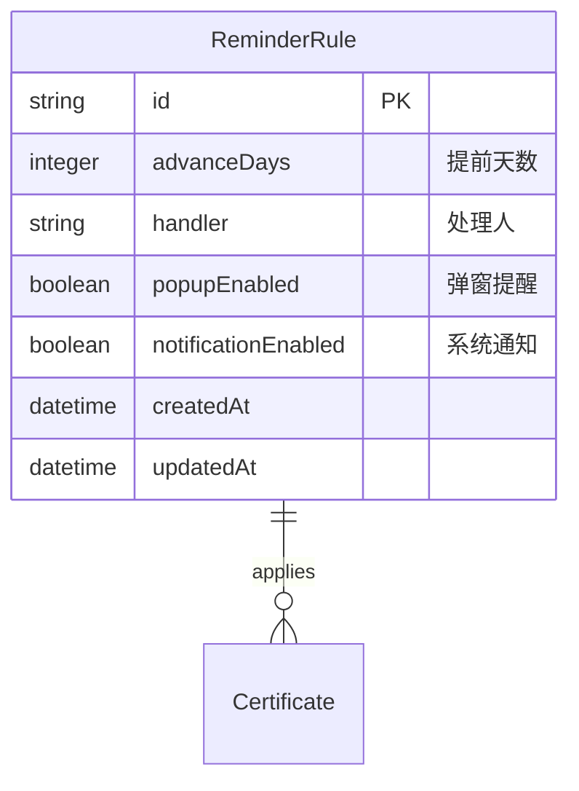
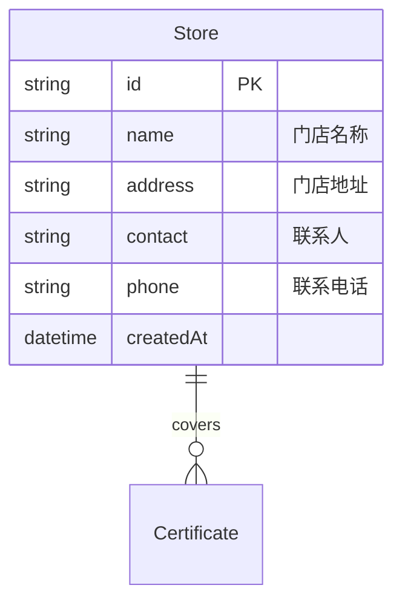

# 证照到期管家 - 技术架构文档

## 1. 架构设计

本项目采用Electron + React技术栈，构建跨平台桌面应用。前端使用React 18 + TailwindCSS实现现代化界面，后端使用Electron提供原生桌面能力。



## 2. 技术栈描述

### 2.1 前端技术
- **框架**：React 18
- **构建工具**：Vite
- **路由**：React Router v6
- **状态管理**：Zustand
- **UI组件库**：Ant Design 5
- **图表库**：ECharts
- **样式**：TailwindCSS
- **图标**：Lucide React

### 2.2 桌面框架
- **Electron**：最新稳定版
- **IPC通信**：electron/ipcMain/ipcRenderer
- **本地存储**：electron-store
- **数据库**：better-sqlite3

### 2.3 工具库
- **日期处理**：dayjs
- **文件操作**：fs-extra
- **Excel导出**：xlsx
- **PDF生成**：jspdf

## 3. 路由定义

| 路由路径 | 页面名称 | 功能描述 |
|---------|---------|---------|
| `/` | 总览页面 | 仪表盘首页，显示状态统计 |
| `/certificates` | 证照库 | 证照列表和管理 |
| `/certificates/:id` | 证照详情 | 查看/编辑单条证照 |
| `/reminders` | 提醒页面 | 提醒规则设置 |
| `/records` | 办理记录 | 办理流程记录 |
| `/statistics` | 统计页面 | 数据分析和导出 |

## 4. 数据模型

### 4.1 证照库数据模型



### 4.2 办理记录数据模型



### 4.3 提醒规则数据模型



### 4.4 门店数据模型



## 5. 核心模块设计

### 5.1 证照状态计算模块

```typescript
// 状态计算逻辑
const calculateStatus = (endDate: string): CertificateStatus => {
  const daysUntilExpiry = dayjs(endDate).diff(dayjs(), 'day');
  
  if (daysUntilExpiry < 0) return 'expired';        // 已过期
  if (daysUntilExpiry <= 30) return 'expiring';     // 即将到期
  return 'normal';                                  // 正常
};
```

### 5.2 提醒检测模块

```typescript
// 定时检查提醒
const checkReminders = () => {
  const certificates = getAllCertificates();
  const rules = getReminderRules();
  
  certificates.forEach(cert => {
    const daysUntilExpiry = dayjs(cert.endDate).diff(dayjs(), 'day');
    const applicableRule = rules.find(r => r.advanceDays >= daysUntilExpiry);
    
    if (applicableRule && applicableRule.popupEnabled) {
      showNotification(cert, applicableRule);
    }
  });
};
```

### 5.3 统计聚合模块

```typescript
// 多维度统计
const generateStatistics = (filters: FilterOptions) => {
  return {
    byStore: groupBy(certificates, 'stores'),
    byType: groupBy(certificates, 'type'),
    byMonth: groupBy(certificates, cert => dayjs(cert.endDate).format('YYYY-MM')),
    byStatus: groupBy(certificates, 'status')
  };
};
```

## 6. 文件结构

```
certificate-manager/
├── public/
│   └── index.html
├── src/
│   ├── main/                 # Electron主进程
│   │   ├── main.ts
│   │   ├── preload.ts
│   │   └── ipc/
│   ├── renderer/             # React渲染进程
│   │   ├── components/       # 通用组件
│   │   │   ├── Layout/
│   │   │   ├── Sidebar/
│   │   │   └── common/
│   │   ├── pages/            # 页面组件
│   │   │   ├── Overview/
│   │   │   ├── Certificate/
│   │   │   ├── Reminder/
│   │   │   ├── Record/
│   │   │   └── Statistics/
│   │   ├── stores/           # Zustand状态
│   │   ├── hooks/            # 自定义Hooks
│   │   ├── utils/            # 工具函数
│   │   ├── types/            # TypeScript类型
│   │   ├── data/             # 模拟数据
│   │   ├── App.tsx
│   │   └── main.tsx
│   └── shared/               # 共享类型
├── electron-builder.json
├── package.json
├── tsconfig.json
├── tailwind.config.js
└── vite.config.ts
```

## 7. 核心功能实现要点

### 7.1 状态管理
- 使用Zustand管理全局状态
- 分离证照数据、用户偏好、系统设置
- 持久化存储关键数据

### 7.2 文件存储
- 扫描件存储在应用数据目录
- 使用UUID重命名避免冲突
- 支持PDF和图片格式预览

### 7.3 打印导出
- 使用CSS print样式优化打印布局
- Excel导出使用xlsx库
- PDF生成使用jspdf库

### 7.4 提醒机制
- 应用启动时检查所有证照
- 设置定时器周期性检查
- 使用Electron Notification API
